# NGINX Upstream Identity Monitor PoC Architecture

Below is the architecture of `zelinsky-alexander/nginx-extension-poc` on `main`, based on the current repository rather than the earlier conceptual design. The core implementation is deliberately small: the NGINX integration lives in `ngx_http_upstream_identity_module.c`, while longitudinal cross-worker state is isolated in `ngx_http_upstream_identity_state.c/.h`.

## 1. Overall block scheme

```mermaid
flowchart LR
    C[Client<br/>curl / application]

    N[NGINX HTTP server<br/>:8080]

    U[NGINX upstream subsystem<br/>round-robin / keepalive]

    M[Upstream Identity Module<br/>ngx_http_upstream_identity_module.c]

    P[Selected upstream peer<br/>IP:port]

    TLS[TLS connection<br/>OpenSSL / X.509]

    OBS[Identity observation<br/>TLS version<br/>ALPN<br/>Cert SHA-256<br/>SPKI SHA-256<br/>Issuer<br/>DNS SAN]

    STATE[Shared longitudinal state<br/>NGINX shared memory]

    TREE[RB-tree index<br/>key = upstream + peer]

    EVENTS[NGINX error log<br/>observation + change events]

    C -->|HTTP request| N
    N -->|proxy_pass| U

    M -. wraps peer callbacks .-> U
    U -->|select peer| P
    P --> TLS

    M -->|inspect live connection| TLS
    TLS --> OBS

    OBS -->|fresh successful TLS| STATE
    STATE --> TREE

    TREE -->|compare previous identity| STATE

    STATE -->|first_seen / cert change / key change| EVENTS
    OBS -->|ordinary observation| EVENTS

    TLS -->|upstream response| N
    N -->|HTTP response| C
```

The important architectural point is that the module **does not replace NGINX's upstream selection algorithm**. It wraps the existing peer lifecycle, calls the original callbacks, then observes the connection NGINX actually selected. That makes the PoC much less invasive. The wrapping begins when `upstream_identity_peer_monitor` saves the original `init_upstream`, substitutes `ngx_http_upstream_identity_init_upstream`, and later wraps the per-request peer callbacks.

---

# 2. Configuration-time architecture

Before any HTTP request is processed, NGINX builds the module configuration.

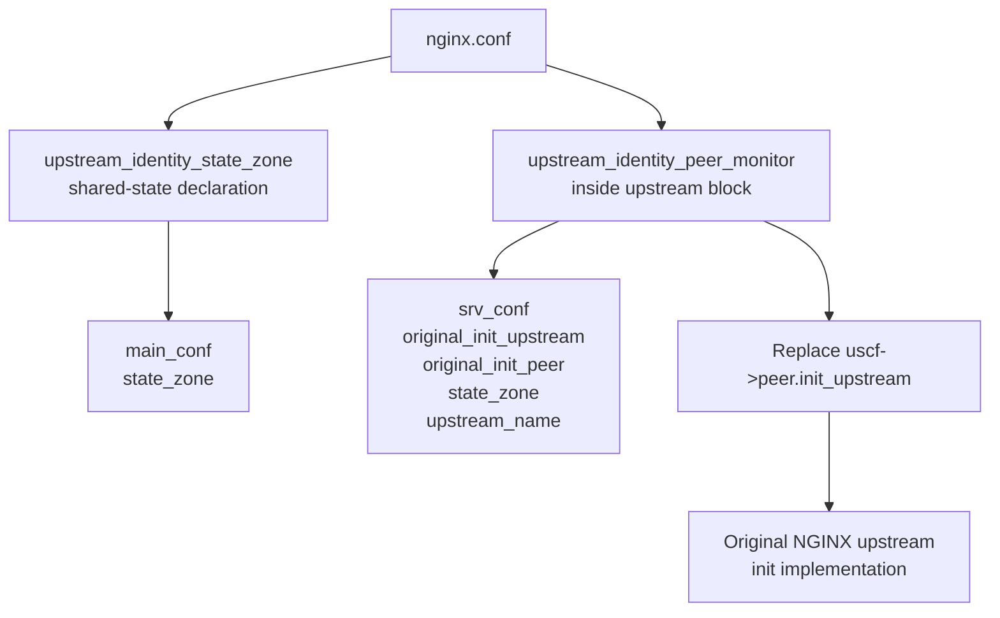

### Relevant configuration directives

The module currently declares three directives:

```text
upstream_identity_state_zone
upstream_identity_monitor
upstream_identity_peer_monitor
```

They are defined in:

```text
src/ngx_http_upstream_identity_module.c
    ngx_http_upstream_identity_commands[]
```

The first creates an NGINX shared-memory zone and installs:

```c
zone->init = ngx_http_upstream_identity_state_init_zone;
```

The peer-monitor directive, meanwhile, intercepts upstream initialization by remembering the original function and substituting its own:

```text
original_init_upstream
        ↓
uscf->peer.init_upstream =
    ngx_http_upstream_identity_init_upstream
```

That configuration logic is all in `ngx_http_upstream_identity_module.c`.

The README's intended configuration is:

```nginx
http {
    upstream_identity_state_zone upstream_identity_state 1m;

    upstream backend_tls {
        server 127.0.0.1:9443;
        keepalive 16;

        upstream_identity_peer_monitor;
    }

    ...
}
```

The shared zone is visible to all workers and survives an NGINX configuration reload when the name and size remain unchanged, but it does **not** survive a complete stop/start.

One small inconsistency is worth noting: the checked-in `lab/nginx.conf` still shows the simpler original peer-monitor lab and does **not** configure `upstream_identity_state_zone`; the README and `LONGITUDINAL_STATE.md` contain the newer longitudinal configuration.

---

# 3. The key NGINX wrapping technique

This is the most interesting part of the PoC.

Rather than implementing a new load balancer:

```text
NGINX normal implementation
       │
       ▼
round robin / keepalive / etc.
       │
       ▼
module wrapper
       │
       ▼
same selected peer
```

the module preserves NGINX's original callbacks.

Conceptually:

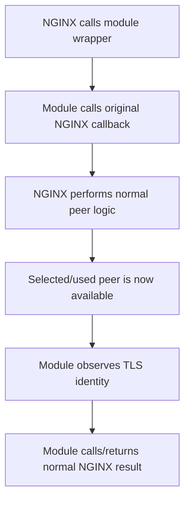

The wrapper state for a request is represented by:

```c
ngx_http_upstream_identity_peer_data_t
```

It stores, among other things:

```text
original_data
original_get
original_free
original_notify
original_set_session
original_save_session

state_zone
upstream_name
```

See:

```text
src/ngx_http_upstream_identity_module.c
    ngx_http_upstream_identity_peer_data_t
```

This is a good design choice because the module can inspect upstream behavior without duplicating or depending heavily on the internal implementation of round-robin selection.

---

# 4. Request-time callback chain

The real runtime path is approximately this:

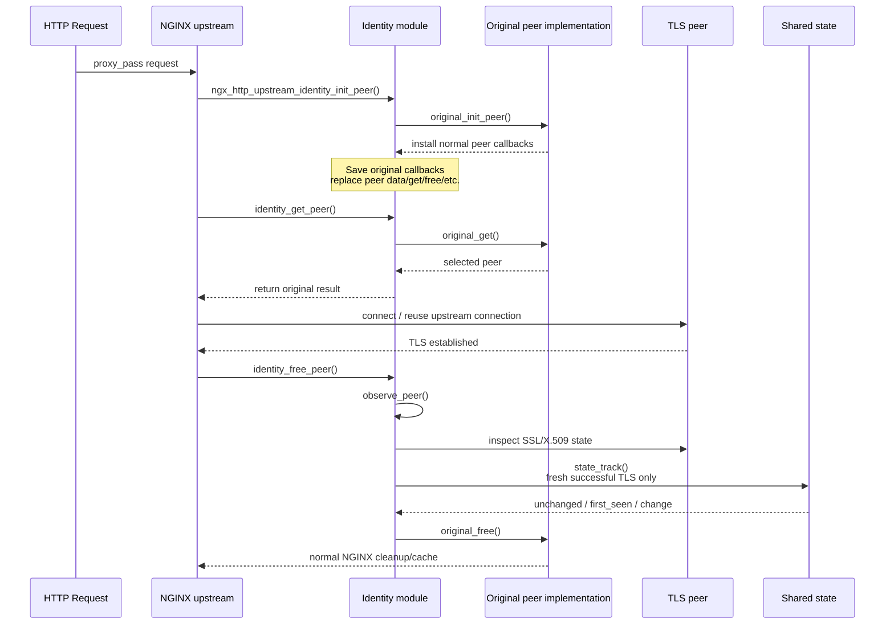

There are two particularly important observation cases.

### New/fresh connection

At `free_peer`, the module receives the connection after upstream processing and before the original free callback completes.

Relevant code:

```text
ngx_http_upstream_identity_free_peer()
    ↓
ngx_http_upstream_identity_observe_peer()
    ↓
ngx_http_upstream_identity_state_track()
```

The call is conditionally marked for longitudinal tracking only when:

```text
state == 0
AND
cached == 0
```

That prevents a reused keepalive connection from being treated as a newly observed identity transition.

### Reused connection

`ngx_http_upstream_identity_get_peer()` checks:

```c
if (rc == NGX_DONE)
```

and logs the peer as:

```text
peer_get_reused
```

but calls observation with:

```text
track_state = 0
```

So keepalive reuse remains observable without modifying the longitudinal baseline.

---

# 5. TLS identity extraction

Once the live upstream connection is available:

```text
ngx_peer_connection_t
        │
        ▼
ngx_connection_t
        │
        ▼
c->ssl
        │
        ▼
SSL*
        │
        ├── TLS version
        ├── ALPN
        └── peer X509 certificate
```

The core code is:

```text
ngx_http_upstream_identity_observe_peer()
```

in:

```text
src/ngx_http_upstream_identity_module.c
```

It obtains:

```text
pc->connection
    ↓
c->ssl->connection
    ↓
OpenSSL SSL *
```

and then extracts:

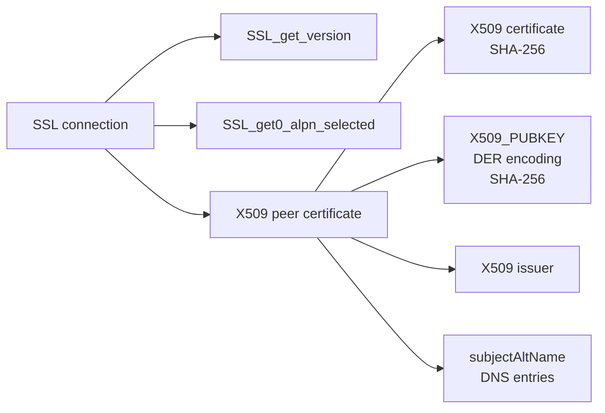

The resulting observation contains:

```text
peer
state
cached
TLS version
ALPN
certificate SHA-256
SPKI SHA-256
issuer
DNS SANs
```

The README describes exactly those as the current capability.

### Code references

Certificate fingerprint:

```text
ngx_http_upstream_identity_cert_sha256()
```

uses:

```text
X509_digest(cert, EVP_sha256(), ...)
```

SPKI fingerprint:

```text
ngx_http_upstream_identity_spki_sha256()
```

performs:

```text
X509_get_X509_PUBKEY
        ↓
i2d_X509_PUBKEY
        ↓
DER bytes
        ↓
EVP_Digest(... EVP_sha256())
```

DNS SAN extraction:

```text
ngx_http_upstream_identity_dns_sans()
```

uses the certificate's:

```text
NID_subject_alt_name
```

and retains `GEN_DNS` entries.

---

# 6. Longitudinal-state architecture

This is the second major subsystem.

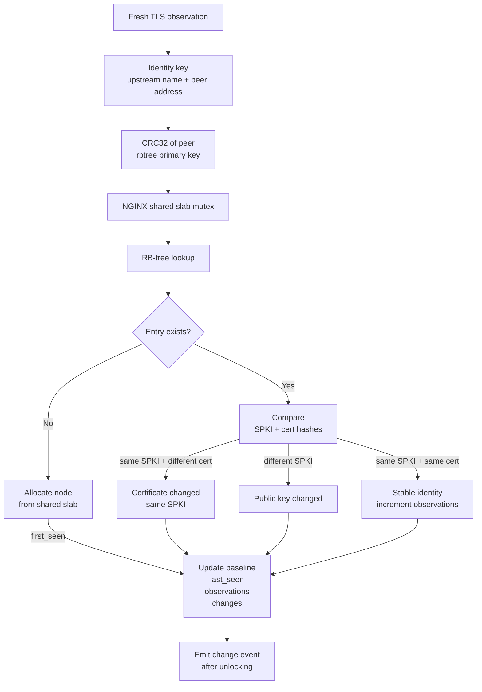

The entire state implementation resides in:

```text
src/ngx_http_upstream_identity_state.c
```

---

# 7. State entry structure

Each shared-memory node contains roughly:

```text
ngx_http_upstream_identity_state_node_t
│
├── ngx_rbtree_node_t node
│
├── upstream_len
├── peer_len
│
├── first_seen
├── last_seen
│
├── observations
├── changes
│
├── cert_sha256[65]
├── spki_sha256[65]
│
└── data[]
     ├── upstream name
     └── peer address
```

The actual structure is defined at the top of:

```text
src/ngx_http_upstream_identity_state.c
```

This is intentionally compact and avoids pointers to process-local heap memory inside shared memory.

---

# 8. State key

A subtle but important architectural choice is:

```text
(upstream name, peer address)
```

rather than just:

```text
upstream name
```

Example:

```text
upstream api_cluster
 ├── 10.0.0.10:443 → certificate A
 ├── 10.0.0.11:443 → certificate B
 └── 10.0.0.12:443 → certificate C
```

If the module kept one global `api_cluster` identity, normal round-robin traffic could look like this:

```text
A → B → C → A → B
```

and falsely appear to be repeated identity changes.

Instead:

```text
api_cluster + 10.0.0.10 → baseline A
api_cluster + 10.0.0.11 → baseline B
api_cluster + 10.0.0.12 → baseline C
```

The design documentation explicitly states this motivation.

---

# 9. RB-tree lookup

The internal shared-state lookup is approximately:

```text
                   CRC32(peer)
                       │
                  RB-tree node
                 /            \
                /              \
          smaller key        larger key

For equal CRC key:
compare full
(upstream + peer)
to resolve collisions
```

The CRC is **not treated as a unique identity**.

The code first calculates:

```c
key = ngx_crc32_short(peer, peer_len);
```

but when keys collide, comparison proceeds using the actual upstream name and peer bytes.

Relevant functions:

```text
ngx_http_upstream_identity_state_insert()
ngx_http_upstream_identity_state_lookup()
ngx_http_upstream_identity_state_compare_parts()
```

So conceptually:

```text
CRC32
  │
  └─ fast tree ordering

upstream + peer
  │
  └─ actual identity equality
```

---

# 10. Concurrency scheme

With multiple NGINX workers:

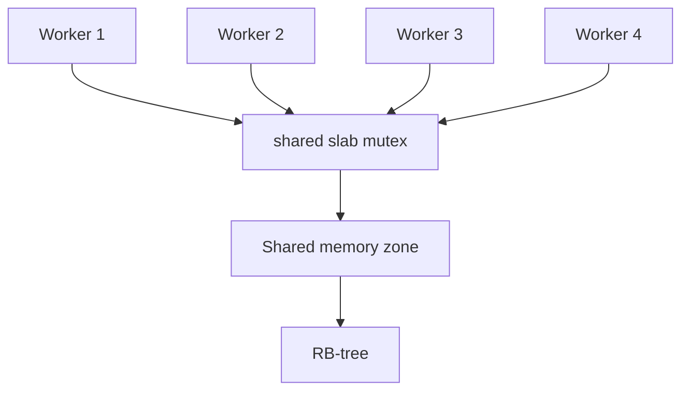

All workers use the same slab pool and tree.

The critical section is:

```text
lock
 ↓
lookup
 ↓
allocate if necessary
 ↓
compare
 ↓
update state
 ↓
unlock
```

Only **after releasing the shared mutex** does the module write the change log.

That's good for the hot path because logging may be substantially slower than an in-memory comparison.

The documentation explicitly states that the lock covers lookup/compare/baseline update and logging is done after unlocking.

The implementation corresponds to that design:

```text
ngx_shmtx_lock(&shpool->mutex)

    lookup
    compare
    allocate/update

ngx_shmtx_unlock(&shpool->mutex)

    ngx_log_error(...)
```

---

# 11. Change-classification state machine

The actual longitudinal logic is simple and quite useful.

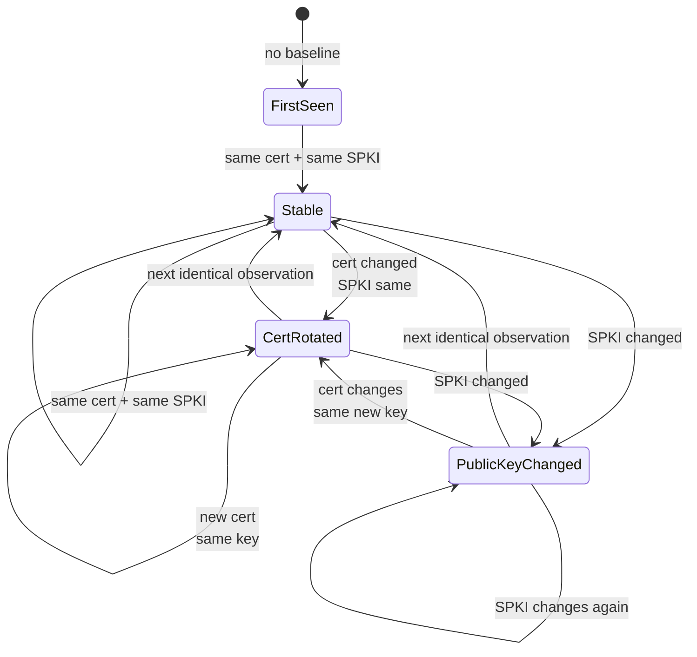

Actual emitted classifications:

```text
first_seen

certificate_changed_same_key

public_key_changed
```

The decision algorithm is:

```text
entry absent
    → first_seen

entry exists
    │
    ├── old SPKI != new SPKI
    │       → public_key_changed
    │
    ├── old SPKI == new SPKI
    │    AND old cert != new cert
    │       → certificate_changed_same_key
    │
    └── both same
            → stable / no change event
```

That's implemented directly inside:

```text
ngx_http_upstream_identity_state_track()
```

The distinction is meaningful:

```text
certificate changes
      │
      ├── same public key
      │      likely renewal/reissue type event
      │
      └── different public key
             stronger identity transition
```

Importantly, the project deliberately calls these **evidence classifications**, not security conclusions. A key change does not automatically mean compromise.

---

# 12. Fresh connection versus keepalive

This deserves its own block because it is essential to correct longitudinal monitoring.

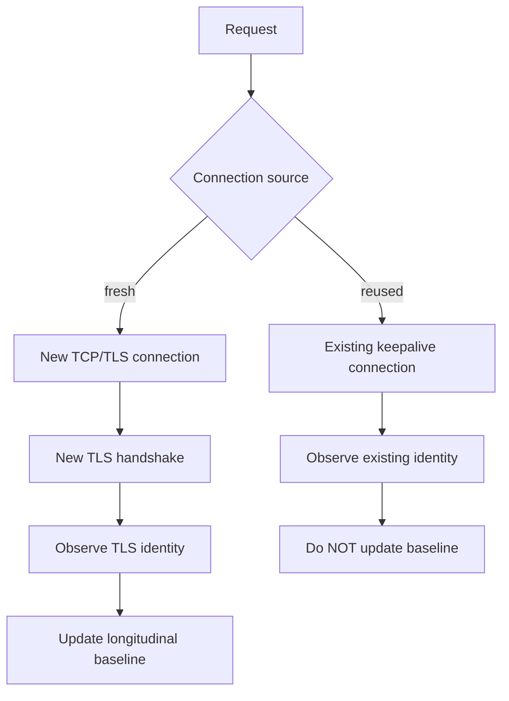

Otherwise a high-traffic keepalive peer could generate thousands of misleading longitudinal "observations" for a handshake that occurred once.

The current design therefore treats:

```text
connection observation
```

and

```text
identity-baseline observation
```

as two distinct concepts.

---

# 13. Logging architecture

There are effectively two event streams.

```text
                    Identity monitor
                         │
             ┌───────────┴────────────┐
             │                        │
      Observation event         Change event
             │                        │
 upstream_identity ...   upstream_identity_change ...
             │                        │
 every observed          only state transition
 connection
```

Typical ordinary observation contains:

```text
upstream_identity
stage="peer_free"
peer="127.0.0.1:9443"
state=0
cached=0
tls="TLSv1.3"
alpn=""
cert_sha256="..."
spki_sha256="..."
issuer="..."
san_dns="backend.test"
```

Longitudinal output looks conceptually like:

```text
upstream_identity_change
change="public_key_changed"
upstream="backend_tls"
peer="127.0.0.1:9443"
previous_cert_sha256="..."
current_cert_sha256="..."
previous_spki_sha256="..."
current_spki_sha256="..."
```

The two-log-stream separation is useful because normal request observations may be high volume while identity transitions should be comparatively rare.

---

# 14. Complete data flow

Putting everything together:

```mermaid
flowchart LR
    REQ[HTTP Request]

    PROXY[proxy_pass]

    INIT[identity_init_peer]

    ORIG[Original NGINX peer callbacks]

    SELECT[Peer selection]

    CONNECT[TCP / TLS connection]

    CERT[X.509 certificate]

    META[Extract identity metadata]

    FRESH{Fresh successful<br/>connection?}

    SHARED[Shared state zone]

    LOOKUP[Lookup upstream + peer]

    COMPARE{Compare baseline}

    NORMAL[No change]

    FIRST[first_seen]

    CERTCHANGE[certificate_changed_same_key]

    KEYCHANGE[public_key_changed]

    LOGOBS[Observation log]
    LOGCHANGE[Change log]

    RESP[Proxy response]

    REQ --> PROXY
    PROXY --> INIT
    INIT --> ORIG
    ORIG --> SELECT
    SELECT --> CONNECT

    CONNECT --> CERT
    CERT --> META

    META --> LOGOBS

    META --> FRESH

    FRESH -->|No / keepalive| RESP

    FRESH -->|Yes| SHARED
    SHARED --> LOOKUP
    LOOKUP --> COMPARE

    COMPARE -->|none exists| FIRST
    COMPARE -->|same| NORMAL
    COMPARE -->|cert differs, SPKI same| CERTCHANGE
    COMPARE -->|SPKI differs| KEYCHANGE

    FIRST --> LOGCHANGE
    CERTCHANGE --> LOGCHANGE
    KEYCHANGE --> LOGCHANGE

    NORMAL --> RESP
    LOGCHANGE --> RESP
```

---

# 15. Process/reload lifetime

The current lifecycle is:

```text
                      NGINX shared memory zone
                              │
       ┌──────────────────────┼──────────────────────┐
       │                      │                      │
    worker 1               worker 2              worker N
       │                      │                      │
       └──────────────────────┼──────────────────────┘
                              │
                         same baseline


nginx reload
    │
    └── same zone name + size
            ↓
       state survives


full nginx stop
       ↓
shared memory destroyed
       ↓
baseline lost

start again
       ↓
first fresh observation
       ↓
first_seen
```

That persistence boundary is explicit in the project: this is **worker-shared longitudinal state**, not yet durable historical storage.

---

# 16. Why there is deliberately no SQLite/file write here

The current design boundary is:

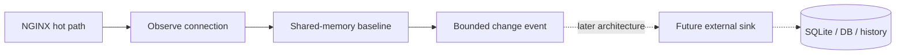

Not:

```text
request
  ↓
TLS callback
  ↓
sqlite INSERT
  ↓
fsync
  ↓
response
```

The README and longitudinal design explicitly reject synchronous file/SQLite persistence inside NGINX request workers. Durable history is intended to be implemented later with a decoupled sink.

For this kind of extension, that's the correct boundary to preserve.

---

# 17. File-to-architecture map

```text
nginx-extension-poc/
│
├── config
│     NGINX dynamic-module build configuration
│
├── src/
│   │
│   ├── ngx_http_upstream_identity_module.c
│   │     │
│   │     ├── NGINX module definition
│   │     ├── directives
│   │     ├── upstream callback interception
│   │     ├── request peer wrapper
│   │     ├── connection observation
│   │     └── OpenSSL/X.509 extraction
│   │
│   ├── ngx_http_upstream_identity_state.c
│   │     │
│   │     ├── shared-memory initialization
│   │     ├── RB-tree
│   │     ├── slab allocation
│   │     ├── shared-worker locking
│   │     ├── identity comparison
│   │     └── change classification
│   │
│   └── ngx_http_upstream_identity_state.h
│         public boundary between module and state layer
│
├── lab/
│   └── nginx.conf
│         minimal live NGINX/TLS experiment
│
├── scripts/
│       certificate-generation/support tooling
│
└── docs/
    ├── DESIGN_NOTES.md
    ├── LAB_SETUP.md
    ├── TESTS.md
    ├── LONGITUDINAL_STATE.md
    └── LONGITUDINAL_VALIDATION.md
```

---

# 18. Most important code references

For reading the implementation in the right order, I would use this sequence:

1. **`ngx_http_upstream_identity_commands[]`**  
   Understand the three directives.

2. **`ngx_http_upstream_identity_peer_monitor()`**  
   See how the module captures NGINX's original upstream initializer.

3. **`ngx_http_upstream_identity_init_upstream()`**  
   See the second-level interception of `us->peer.init`.

4. **`ngx_http_upstream_identity_init_peer()`**  
   This is the important per-request hook that saves and wraps the actual peer callbacks.

5. **`ngx_http_upstream_identity_get_peer()`**  
   Handles selection/reused-peer observation.

6. **`ngx_http_upstream_identity_free_peer()`**  
   Main point at which the completed live connection is observed.

7. **`ngx_http_upstream_identity_observe_peer()`**  
   Central TLS/X.509 extraction function.

8. **`ngx_http_upstream_identity_state_track()`**  
   Core longitudinal decision engine.

9. **`ngx_http_upstream_identity_state_lookup()`**  
   RB-tree lookup.

10. **`ngx_http_upstream_identity_state_insert()`**  
    RB-tree ordering/collision handling.

The module-side functions are in `ngx_http_upstream_identity_module.c`; the longitudinal functions are in `ngx_http_upstream_identity_state.c`.

## The architecture in one sentence

The PoC is essentially:

```text
NGINX upstream callback decorator
        +
live OpenSSL identity extraction
        +
shared-memory (upstream,peer) baseline
        +
evidence-oriented transition logging
```

rather than a replacement proxy, load balancer, certificate validator, or database-backed monitoring system.

That distinction is what makes the current PoC technically interesting: it demonstrates that **an unpatched NGINX dynamic module can attach to the real upstream peer lifecycle, observe the actual TLS identity NGINX used, and maintain a cross-worker longitudinal baseline while staying out of the normal load-balancing decision and avoiding blocking durable I/O.**

One thing I would change next in the repository documentation is `lab/nginx.conf`: bring it in sync with the newer README by adding the state zone and keepalive configuration, so someone cloning `main` immediately exercises both peer observation **and** longitudinal monitoring rather than only the original observation PoC.
